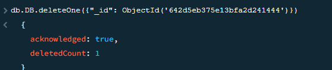
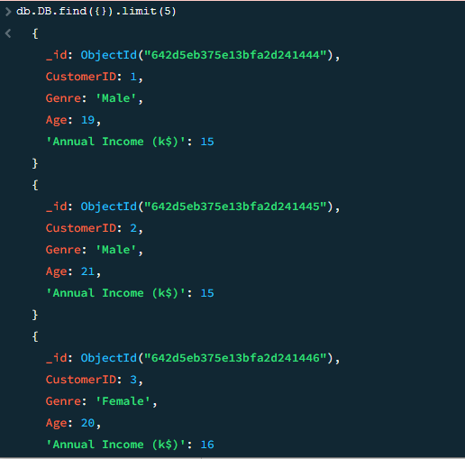
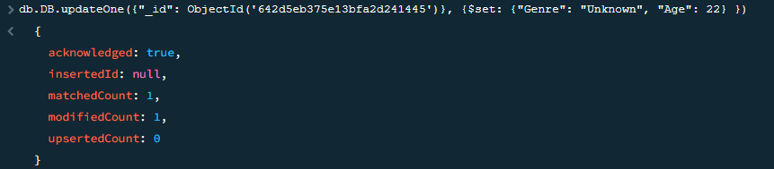
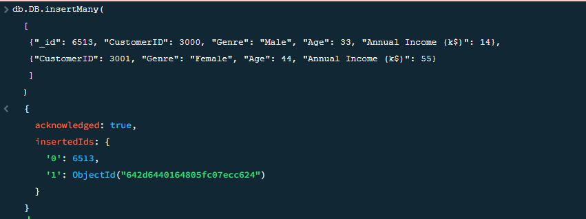
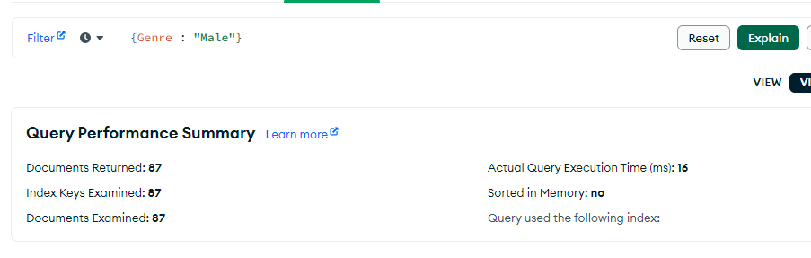
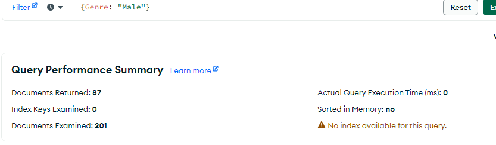

# Знакомство с MongoDB
Удаление из существующей базы данных:

Выборка 5 верхних клиентов:

Изменяем информацию об одном клиенте:

Добавляем информацию о двух новых клиентах:

После создания индекса по полам, эффективность повышается до 87 запросов против 200

