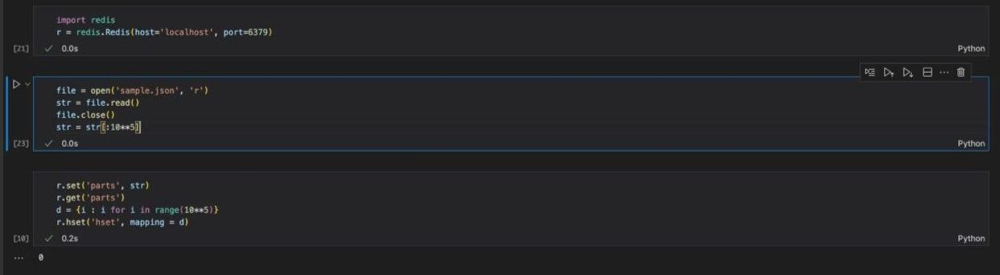
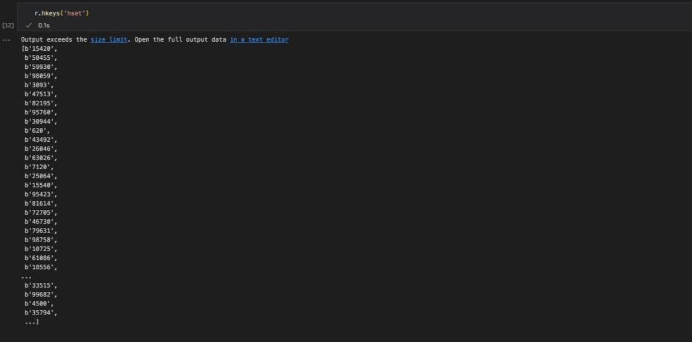
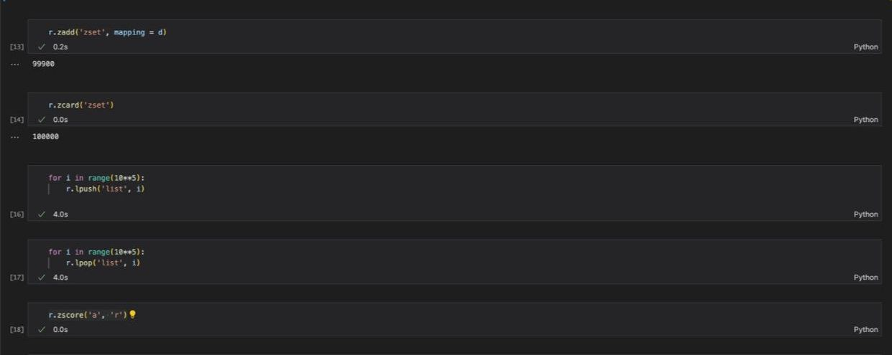
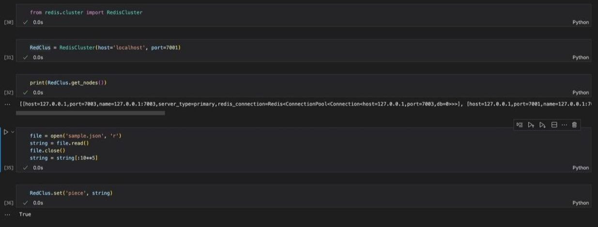
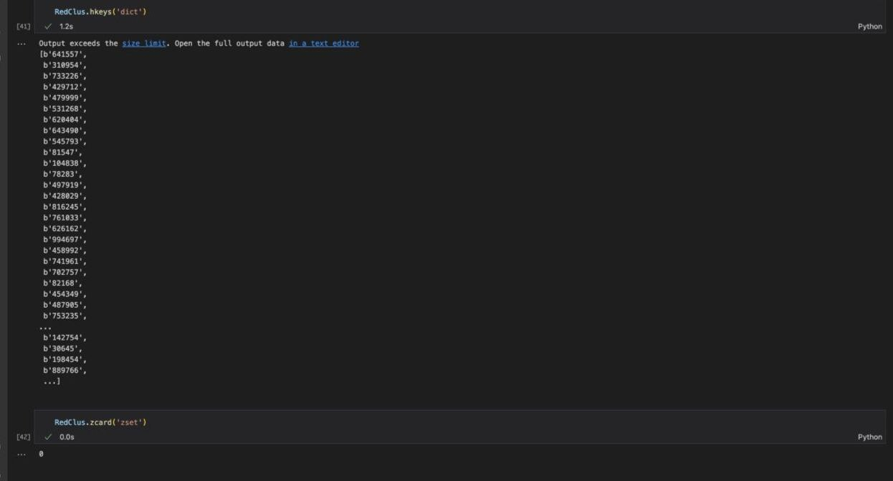
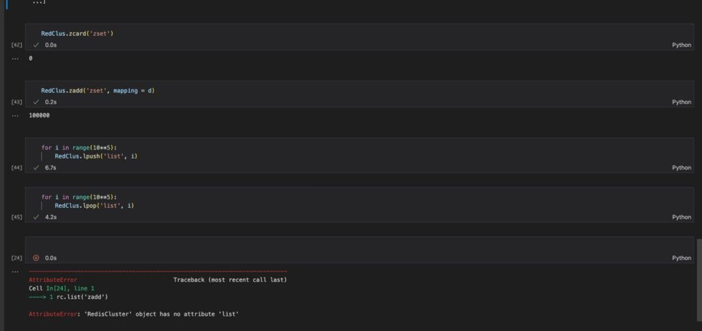

Установим соединение с Redis. После работы в консоле представленной по этой ссылке: https://redis.io/docs/getting-started/installation/install-redis-on-mac-os/
Переходим к написанию кода на питоне

На втором этапе разобьем исходный json на структуры, о которых говорилось в задании и заодно посчитаем время записи чтения 

Настроим Redis Cluster:
Как сказано по ссылке: https://redis.io/docs/management/scaling/#create-a-redis-cluster
Выполняем действия в терминали (создаем папки и в них redis.conf файлы, в которых пишем код из ссылки для каждрй из папок, хотя вместо шести как сказано там, берем 3 по заданию) После одновременного запуска всех файлов и написания команды по запуску кластера по аналогии с обычным redis пишем код и пробуем запустить команды

