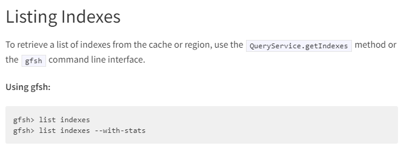
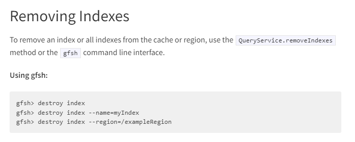

# Apache Geode

## История развития

Apache Geode начиналась как версия с открытым исходным кодом продукта под названием GemFire, первоначально разработанного GemStone Systems. GemFire нашла свое первое промышленное применение несколько десятилетий назад в качестве механизма транзакционных данных с малой задержкой для торговли на Уолл-Стрит. 

В мае 2010 года GemStone была приобретена SpringSource. Вскоре после этого он стал ключевой частью Pivotal. Вскоре после этого, в 2015 году, Pivotal предложила Apache Software Foundation (ASF) создать инкубационное сообщество Apache Geode, чтобы способствовать его развитию, и оно это сделало. Поддержка сообщества вокруг проекта резко возросла, и к концу 2016 года он стал проектом Apache высшего уровня. Сообщество Geode теперь публикует новую версию ветки GitHub ежеквартально, в частности, в первый понедельник 1 февраля, 1 мая, 1 августа и 1 ноября. 

Сегодня Spring Boot для Apache Geode и Pivotal GemFire предоставляет любому клиенту удобство подхода Spring Boot «соглашение вместо конфигурации» с использованием автоматической настройки с мощными абстракциями Spring Framework и высоко согласованной моделью программирования.

# Инструменты для взаимодействия с СУБД

* gfsh (произносится как «джи-фиш») предоставляет единый мощный интерфейс командной строки, из которого вы можете запускать, управлять и отслеживать процессы, данные и приложения Geode.

* Gemcached — это адаптер Geode, который позволяет клиентам Memcached взаимодействовать с кластером серверов Geode, как если бы эти серверы были серверами memcached. Memcached — это решение для кэширования с открытым исходным кодом, которое использует распределенную хеш-карту в памяти для хранения пар ключ-значение строковых или объектных данных.

* Модули управления HTTP-сессиями Apache Geode обеспечивают быструю, масштабируемую и надежную репликацию сессий для HTTP-серверов без необходимости внесения изменений в приложения.

* Geode Pulse — это веб-приложение, которое предоставляет графическую панель мониторинга для мониторинга в режиме реального времени жизненно важного состояния и производительности кластеров, участников и регионов Geode.

* Интеграция с Apache Lucene® позволяет пользователям создавать индексы Lucene и выполнять поиск Lucene по данным, хранящимся в Geode.

* Micrometer — это простой фасад для мониторинга приложений (например, SLF4J — это простой фасад для ведения журнала), который позволяет публиковать метрики из Geode в различные инструменты мониторинга производительности приложений (APM).

## Database Engine

СУБД Apache Geode использует IMDG (In-Memory Data Grid) в качестве Data Engine.

IMDG - это система управления данными, которая хранит данные в памяти, обеспечивая быстрый доступ к данным и высокую производительность. IMDG работает в распределенной среде, где данные хранятся на нескольких узлах, образуя кластер. Кластер может быть масштабирован горизонтально, добавляя новые узлы для увеличения производительности и емкости хранения данных.

IMDG, используемый в Apache Geode, имеет множество функций, которые делают его подходящим для работы с большими объемами данных и требовательными к производительности приложениями. Некоторые из этих функций включают в себя распределенное кэширование данных, поддержку транзакций, высокую доступность и масштабируемость, поддержку SQL-запросов и т.д.

IMDG в Apache Geode также поддерживает различные модели данных, такие как ключ-значение, объектно-ориентированные данные и документы. Это позволяет использовать Apache Geode в различных приложениях и сферах деятельности, где необходимо обрабатывать большие объемы данных в реальном времени и обеспечивать высокую доступность и масштабируемость данных.

## Как устроен язык запросов в СУБД?

Apache Geode предоставляет поддержку SQL-подобных запросов с помощью языка OQL (Object Query Language), который является декларативным языком запросов. OQL позволяет выполнять запросы к данным, хранящимся в IMDG (In-Memory Data Grid) в Geode.

OQL понимает множество операторов, таких как SELECT, FROM, WHERE, ORDER BY, GROUP BY, и т.д. Он поддерживает различные функции, включая агрегатные функции, функции для работы со строками и датами, функции математических операций и т.д. ОQL также позволяет использовать JOIN для объединения данных из различных регионов в IMDG.

## Возможно ли распределение файлов БД по разным носителям?

По умолчанию, файлы БД в Geode хранятся на диске в формате Apache Geode Portable Data eXchange (GEMFIRE-PDX) и могут быть сохранены в одном каталоге на диске. Однако, если нужно распределить эти файлы по разным носителям, можно настроить Apache Geode для использования файловой системы, которая поддерживает распределенное хранение файлов, такую как Hadoop Distributed File System (HDFS) или Amazon S3. 
Следовательно, распределение файлов БД по различным носителям возможно в Apache Geode.

## На каком языке программирования написана СУБД?

Apache Geode написан на языке Java и использует библиотеки и инструменты Java-экосистемы, такие как Spring Framework, Apache Tomcat, Gradle и другие. 
Также, клиентские библиотеки дают возможность подключить и другие языки программирования. Среди них C++, Python, C#.

## Какие типы индексов поддерживаются в БД?

Некоторые из поддерживаемых типов индексов в Geode:
* Hash Index: Этот тип индекса использует хеш-таблицу для быстрого поиска записей в регионе на основе значения ключа или атрибута. Hash Index поддерживается как для одиночных атрибутов, так и для составных атрибутов.

* Range Index: Этот тип индекса используется для быстрого поиска записей в регионе на основе значений атрибутов, которые находятся в заданном диапазоне значений.

* Key Index: Этот тип индекса используется для быстрого доступа к записям в регионе на основе значений ключа.

* Primary Key Index: Используется для быстрого доступа к записям в регионе на основе значения первичного ключа.

* Compact Range Index: Используется для быстрого поиска записей в регионе на основе значений атрибутов, которые находятся в заданном диапазоне значений. Compact Range Index используется для регионов, в которых записи содержат множество атрибутов.

## Как строится процесс выполнения запросов в СУБД?

* Анализ запроса: при получении запроса, Geode анализирует его и определяет, какие данные нужны для выполнения запроса, и где эти данные находятся в кластере;
* Распределение запроса: затем Geode распределяет запросы по узлам кластера, которые содержат необходимые данные. Распределение запроса выполняется с помощью балансировки нагрузки и механизмов маршрутизации;

* Выполнение запроса: каждый узел кластера, который получил запрос, выполняет свою часть запроса. Это может включать в себя сканирование данных, выполнение запросов на языке SQL или выполнение пользовательского кода на сервере;

* Объединение результатов: после выполнения запроса, результаты собираются обратно на узле, который инициировал запрос, и отправляются обратно клиенту;

* Кэширование результатов: Geode также предоставляет возможность кэширования результатов запросов для повторного использования. Кэширование результатов может существенно ускорить выполнение запросов в случае, если запросы выполняются повторно.

## Есть ли в СУБД понятие “план запросов”?

Да, есть. Это происходит следующим образом:
При выполнении запросов, Apache Geode анализирует запрос и создает план запроса, который определяет, какие узлы кластера необходимо обратиться для выполнения запроса, какие индексы использовать и какие операции выполнить для получения требуемых данных. Этот план запросов может быть использован повторно для более быстрого выполнения запросов, которые имеют похожие структуры и условия. Сама СУБД позволяет контролировать и оптимизировать процесс создания плана запросов с помощью управления индексами, выбора оптимальных алгоритмов и настройкой параметров запросов. 

# Поддерживаются ли транзакции в СУБД?

Да, Apache Geode поддерживает транзакции. В Apache Geode транзакции могут быть использованы для выполнения группы операций в кластере как единую атомарную операцию. Каждая транзакция в Geode обладает уникальным идентификатором, и все операции, выполняемые в рамках транзакции, должны быть завершены либо успешно, либо откатиться полностью.

Geode поддерживает два вида транзакций: локальные и глобальные. Локальные транзакции могут быть использованы для выполнения операций на одном узле кластера. Глобальные транзакции, с другой стороны, позволяют выполнять операции в нескольких узлах кластера, и поддерживаются с помощью транзакционного менеджера JTA (Java Transaction API).

Вообще, транзакции в Apache Geode поддерживаются в режиме ACID (atomicity, consistency, isolation, durability), что обеспечивает надежность и целостность данных в любой ситуации, включая сбои системы и сетевые проблемы.

'''
@Override
  public void execute(FunctionContext context) {
    RegionFunctionContext rfc = (RegionFunctionContext) context;
    Region<ProductId, Integer> inventoryRegion = rfc.getDataSet();

    CacheTransactionManager 
        txManager = context.getCache().getCacheTransactionManager();

    // single argument will be a ProductId and a quantity
    ProductRequest request = (ProductRequest) rfc.getArguments();
    ProductId productRequested = request.getProductId();
    Integer qtyRequested = request.getQuantity();

    boolean success = false;

    do {
      boolean commitConflict = false;
      try {
        txManager.begin();

        Integer qtyAvailable = inventoryRegion.get(productRequested);
        if (qtyAvailable >= qtyRequested) {
          // enough inventory is available, so process request
          Integer remaining = qtyAvailable - qtyRequested;
          inventoryRegion.put(productRequested, remaining);
          txManager.commit();
          success = true;
        } 

      } catch (CommitConflictException conflict) {
        // retry transaction, as another request on this same key succeeded,
        // so this transaction attempt failed
        commitConflict = true;
      } finally {
        // All other exceptions will be handled by the caller; however,
        // any exception thrown by a method other than commit() needs
        // to do a rollback to avoid leaking the transaction state.
        if(txManager.exists()) {
          txManager.rollback();
        }       
      }

    } while (commitConflict);

    context.getResultSender().lastResult(success);
  }

  @Override
  public String getId() {
    return "TxFunction";
  }

  /**
   * Returning true causes this function to execute on the server
   * that holds the primary bucket for the given key. It can save a
   * network hop from the secondary to the primary.
   */
  @Override
  public boolean optimizeForWrite() {
    return true;
  }
}
'''

## Какие методы восстановления поддерживаются в Apache Geode?

Apache Geode поддерживает несколько методов восстановления, чтобы гарантировать целостность и надежность данных в случае сбоев или сбоев системы:

* Журналирование: Все операции записываются в журнальные файлы, которые можно использовать для восстановления состояния системы после сбоя или перезагрузки. Журналирование может быть использовано как единственный метод восстановления или в сочетании с другими методами.

* Копии (кэширование на диске): Apache Geode может кэшировать данные на диске, чтобы обеспечить их сохранность при сбоях или перезагрузке системы. Копии данных на диске можно использовать для быстрого восстановления состояния кластера.

* Отправка данных на другие узлы кластера: Apache Geode может реплицировать данные на другие узлы кластера, чтобы обеспечить их сохранность в случае сбоя одного из узлов. Когда один узел отказывает, другой узел может использовать реплицированные данные для продолжения работы.

* Восстановление из журнальных файлов: Когда система перезагружается после сбоя, Apache Geode может использовать журнальные файлы для восстановления состояния кластера. Этот процесс может занять некоторое время в зависимости от размера кластера и объема данных.

* Восстановление из кэша на диске: Если Apache Geode кэшировал данные на диске, система может использовать эти данные для быстрого восстановления состояния кластера после сбоя.

* Восстановление из реплицированных данных: Если данные были реплицированы на другие узлы кластера, система может использовать эти данные для восстановления состояния кластера после сбоя одного или нескольких узлов.
 
## Шардинг

Принцип работы шардинга в Apache Geode заключается в том, что каждый узел кластера отвечает за определенную часть данных, которые хранятся в памяти или на диске. Когда приложение пытается получить доступ к данным, Apache Geode определяет, на каком узле кластера данные должны быть найдены, и направляет запрос на соответствующий узел. Если данные не найдены на текущем узле, Apache Geode перенаправляет запрос на другой узел кластера, который отвечает за нужную часть данных.

Apache Geode поддерживает несколько типов шардинга:
* Репликация: Данные копируются на все узлы кластера. Это обеспечивает высокую доступность данных, но может быть неэффективным для больших объемов данных.

* Перемещение: Данные перемещаются между узлами кластера при изменении количества узлов. Благодаря этому получается более равномерное распределение нагрузки и более эффективное использование ресурсов, но может привести к проблемам при перемещении больших объемов данных.

* Хэширование: Данные распределяются между узлами кластера на основе хэш-функции. Это дает равномерное распределение данных и более эффективное использование ресурсов, но может привести к проблемам при добавлении или удалении узлов кластера.
* Разделение по диапазону: Данные распределяются между узлами кластера на основе заданного диапазона значений ключей. Это обеспечивает более эффективное использование ресурсов и уменьшает потребность в перемещении данных при добавлении или удалении узлов кластера, но может привести к неоднородному распределению данных в зависимости от расположения ключей.

## Возможно ли применить термины Data Mining, Data Warehousing и OLAP в СУБД?

Да, возможно. Касаемо каждого из вышеперечисленных:
* Data Mining. В СУБД AG возможно использование алгоритмов машинного обучения и анализа данных для обнаружения паттернов и принятия решений на основе этих данных.

* Data Warehousing. В AG данные хранятся в распределенном кэше, который может быть масштабирован по мере необходимости.

* OLAP. В AG возможно использование агрегатных функций и операций с массивами данных для выполнения OLAP-запросов.

## Какие методы защиты поддерживаются в Apache Geode?

* Аутентификация: Apache Geode предоставляет возможность аутентификации пользователей и приложений с использованием различных методов, включая LDAP, OAuth, Kerberos и другие.

* Авторизация: Apache Geode поддерживает управление доступом на уровне объектов, которое позволяет настраивать права доступа к объектам и операциям на уровне пользователя или группы пользователей.

* Шифрование: поддерживается шифрование данных в памяти и в пути между узлами, используя различные алгоритмы шифрования, такие как AES.

* Аудит: Apache Geode позволяет вести аудит действий пользователей и приложений, позволяя отслеживать изменения в данных и доступ к объектам.

* Кластеризация и репликация: обеспечивает высокую доступность данных и защиту от потери данных в случае сбоя системы.

* Резервное копирование: Apache Geode поддерживает резервное копирование данных, которое позволяет восстанавливать данные в случае потери или повреждения.

## Какие сообщества развивают Apache Geode? Кто имеет право на коммит и создание дистрибутива версий?

Apache Geode является проектом фонда Apache Software Foundation (ASF), который является открытым исходным кодом. Разработка Apache Geode осуществляется сообществом разработчиков, в которое входят как отдельные разработчики, так и компании.

Как и у всех проектов ASF, все участники Apache Geode равноправны, и каждый участник может вносить свой вклад в проект, т.е. каждый участник имеет право на коммит кода и создание дистрибутива версий.

Однако для того, чтобы внести изменения в основную ветку кода (trunk), участник должен произвести доработки, пройти ревью кода и убедиться в том, что его изменения не нарушают совместимость с предыдущими версиями и не нарушают работу существующего функционала.

[Документация]([url](https://geode.apache.org/docs/guide/114/about_geode.html))
